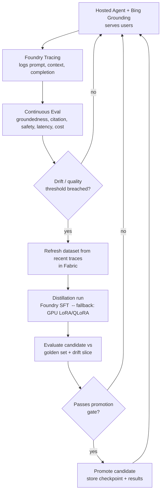

# Distillation Loop & Azure Architecture

> Tasks #3–5 from Nikhil's list: *Identify new data to fine-tune/distill on;
> create the fine-tune/distillation loop; if Foundry lacks an easy abstraction,
> provision a GPU and code a LoRA/PEFT loop.*

## Why Distillation (not Fine-Tuning) Is the Primary Path

- The scenario **starts with a frontier model collecting production traces** —
  exactly the input distillation consumes (teacher completions → smaller
  student). The data already exists as a byproduct of running the agent.
- **Foundry has a native distillation abstraction**, so we stay on-stack and
  reinforce the "cohesive Azure" thesis. Hand-coded GPU training is the
  **fallback**, not plan A.
- Distillation needs **less human labeling** than DPO (preference pairs) or RFT
  (graders) → fastest path to a working loop for the demo.
- We will **address the alternatives (DPO, RFT) in the presentation** and argue
  why distillation fits this task — per Nikhil's request.

> **Constraint:** no full fine-tuning. Distillation here means **SFT on teacher
> outputs**; the fallback is **LoRA / QLoRA (PEFT)**. Never full-parameter.

## What Data We Distill On

| Source | Content | Role |
| --- | --- | --- |
| **Production traces** | `(question + retrieved_context) → frontier_completion (+ citations)` | Primary distillation target |
| **Curated golden set** | Human-accepted subset of the above | High-quality core |
| **(Optional) external TMG corpus** | Public TMG docs / glossaries for domain grounding | Supplemental |

### The Key Distillation Subtlety

We distill the **reasoning / synthesis / citation over provided context**, *not*
retrieval. Each training example is:

```
input  = system + user question + retrieved Bing context (snapshot)
target = frontier briefing (answer + citations)
```

The student learns to **reason and cite over context it is given**, while
retrieval stays live via Bing at inference. This is honest (no leakage of
"future" web state into weights) and explains *why drift still matters*: the
retrieved-context distribution shifts even though retrieval itself isn't learned.

## The Continuous Loop



1. **Serve** — Foundry hosted agent answers user queries using Bing grounding.
2. **Trace** — Foundry tracing logs prompt + retrieved context + completion +
   eval signals.
3. **Continuous eval** — scores live responses (groundedness, citation, safety,
   latency, cost).
4. **Drift / quality monitor** — Eventhouse watches for score decay or query-mix
   shift; fires a trigger when thresholds break.
5. **Dataset refresh** — pull recent accepted traces from Fabric into a new
   training file.
6. **Distill** — launch Foundry SFT distillation (fallback: GPU LoRA/QLoRA).
7. **Evaluate candidate** — against frozen golden set + current drift slice.
8. **Promote** — only if the [promotion gate](golden-dataset-and-eval.md#promotion-gate-decision-rule)
   passes; store checkpoint (Blob) and results (SQL).

## Plan A vs Plan B (Customization)

| | Plan A — Foundry distillation | Plan B — GPU + LoRA/QLoRA |
| --- | --- | --- |
| When | Default; abstraction is sufficient | Foundry abstraction too limiting |
| Method | SFT distillation from stored completions | PEFT (LoRA/QLoRA) on exported dataset |
| Reuses | On-stack, minimal code | Prior project's training expertise |
| Output | Foundry-deployed fine-tuned model | Adapter merged + deployed |

> Verify before committing to Plan A: confirm Foundry distillation keeps the
> training method within SFT/PEFT (not full-parameter) for the chosen student
> model and that the student is a supported, deployable size.

## Azure Architecture Mapping

| Layer | Service | Role in the loop |
| --- | --- | --- |
| AI provider | Microsoft Foundry | Models, customization, evals |
| Agent runtime | Foundry hosted agents + **Grounding with Bing Search** | Serve grounded research |
| Evals & tracing | Foundry tracing + continuous/batch eval | Steps 2–3, 7 |
| Golden dataset | Microsoft Fabric | Dataset of record (step 5) |
| Checkpoint storage | Azure Blob Storage | Model checkpoints (step 8) |
| Eval results & completions | Azure SQL DB | Eval rows + prompt/completion log |
| Agent memory | Foundry IQ / Cosmos DB | Persistent agent memory |
| Drift / failure / latency signals | Eventhouse | Trigger source (step 4) |
| Dashboards | Power BI | Model performance & drift over time (Blu) |

## Division of Work (from the Teams thread)

- **Jose:** scenario, golden dataset + eval metric, distillation loop (this repo).
- **Blu:** database option, Event Hub, dashboarding (Power BI) for performance &
  drift over time.
- **Together (by Fri):** make the loop run automatically; wire Foundry traces /
  prompts / completions / eval results into the database; visualize.

## Open Questions for the Team

- Trigger policy: scheduled retrain vs purely drift-triggered vs both?
- Student model choice (size / family) for the distilled model.
- How much of the loop to **automate live** in the demo vs **show pre-baked
  artifacts** for time.
