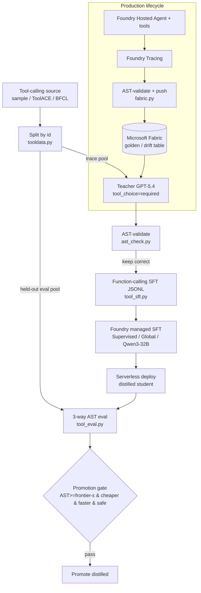

# Distillation Loop & Architecture — Foundry-native, no GPU

> Tasks #3–5. The end-to-end loop that distills a small tool-calling model and
> keeps it current, plus the Azure / Fabric architecture around it.

## The loop in one diagram

## Step by step (Foundry-native — no GPU)

1. **Baselines (no training yet).**
   - Confirm the deployed **GPT-5.4** (and any fine-tuned/proxy qwen) expose the
     function-calling API (`smoke_toolcalling.py`). **Base Qwen3-32B inference is
     unavailable**, so the "before" column is optional (omit, or use a near-base
     format-primer proxy).
   - Run the **3-way AST eval** on frontier + base (distilled empty for now) to
     record the starting gap.
2. **Generate distillation data.**
   - `gen_tool_traces.py` → teacher calls tools → **AST-validate** → keep correct
     → `tool-traces-*.jsonl`.
3. **Build the SFT set.**
   - `build_tool_sft.py` → function-calling SFT JSONL (`messages` + `tools` +
     assistant `tool_calls`) + validator.
4. **Distill (Foundry managed SFT).**
   - Upload the JSONL to the Foundry **Fine-tune** wizard → **Supervised**,
     **Global**, base **Qwen3-32B** → train. **No GPU** — fine-tuned Qwen deploys
     **serverless**.
5. **Deploy + eval.**
   - Deploy serverless, set `STUDENT_FINETUNED_DEPLOYMENT`, run
     `run_tool_eval.py`. Target: `distilled ≥ frontier ≫ base`.
6. **Cost/latency.**
   - The eval records p50/p95 latency + output tokens per model — the "parity at
     lower cost" number, kept separate from AST %.
7. **Lifecycle wiring.**
   - Foundry Hosted Agent runs the toolset → **Foundry Tracing** logs turns →
     `push_to_fabric.py` AST-validates and pushes accepted traces into a
     **Microsoft Fabric** Lakehouse table (golden/drift of record) → retrain on
     accepted rows → eval → **promotion gate** → checkpoints to Blob, eval rows
     to Azure SQL DB, drift signals to Eventhouse. (Blu owns DB + dashboards.)
8. **Drift demo.**
   - Inject new tools / changed schemas → AST accuracy drops → retrain on fresh
     correct traces → accuracy recovers. The dashboard line moves.

## Why Foundry managed SFT (not GPU/LoRA)

- The subscription has **zero GPU quota** (all NC/ND/NV families at limit 0), so
  GPU Managed Compute + LoRA/QLoRA is **not available**.
- Fine-tuned Qwen models **deploy serverless** on Foundry (proven), so the entire
  customize → deploy → serve path needs **no GPU capacity**.
- It's the lowest-effort, most "cohesive Azure" path — upload a JSONL, train,
  deploy. Stays within the **SFT** guardrail (never full-parameter training).

No Axolotl / SGLang / vLLM / LoRA-on-GPU anywhere in this repo.

## Foundry Tracing → Microsoft Fabric (the data plane of record)

Production traces are the real training/golden data:

1. The hosted agent serves requests; **Foundry Tracing** captures each turn
   (request, tools offered, `tool_calls`, outcome).
2. `fabric.py` **AST-validates** each traced call and pushes the **accepted**
   rows to a **Fabric Lakehouse** table via OneLake's ADLS Gen2 endpoint
   (`https://onelake.dfs.fabric.microsoft.com/<workspace>/<lakehouse>.Lakehouse/Files/...`),
   authenticated with `DefaultAzureCredential`.
3. If Fabric env/SDK isn't configured, it writes a **Fabric-ready** JSONL locally
   and prints the exact `az storage fs file upload` command — so the step is
   never a hard blocker.

> **Fabric is a separate permission plane** (workspace + capacity + license) from
> Azure RBAC, and is partly Blu's domain. Don't block the distillation loop on
> Fabric — generate JSONL locally first, add the Fabric push in parallel.

## Azure architecture

| Layer | Service | Role |
| --- | --- | --- |
| AI provider | Microsoft Foundry | Models + agents + tracing + managed SFT |
| Agent runtime | Foundry Hosted Agents | Runs the TMG toolset (incl. `web_search`) |
| Evals & tracing | Foundry Tracing + in-repo AST eval | Continuous + batch AST scoring |
| Customization | Foundry managed SFT (Qwen3-32B, serverless) | Distill the student, no GPU |
| Golden / drift | **Microsoft Fabric** (OneLake) | Accepted traces of record |
| Checkpoints | Azure Blob Storage | Model/checkpoint artifacts |
| Eval results | Azure SQL DB | Scores over time |
| Drift signals | Eventhouse | Latency/failure/drift → retrain trigger |
| Dashboards | Power BI | The single AST line over time |

## Tenant portability

The code is `.env`-driven, so porting to another tenant = provision the resources
and fill `.env` (`FOUNDRY_PROJECT_ENDPOINT`, the three model deployment names,
`TOOLCALLING_SOURCE`, `FABRIC_WORKSPACE_ID`, `FABRIC_LAKEHOUSE`). The full
checklist (resources, RBAC, Fabric license, smoke test) is in
[`build-plan.md`](build-plan.md) §A.

## Success criteria

- **Headline:** distilled Qwen3-32B AST accuracy **≥ GPT-5.4** on the held-out
  pool.
- **Cost:** distilled materially cheaper + faster at comparable accuracy.
- **Loop:** drift → retrain → recovery visibly demonstrated.
